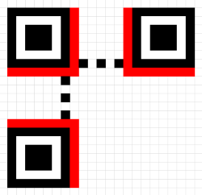
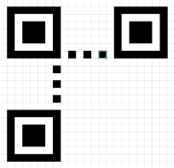
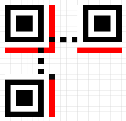
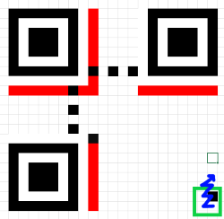
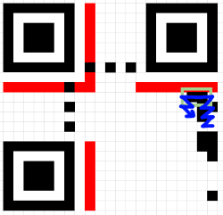
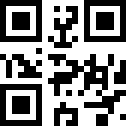
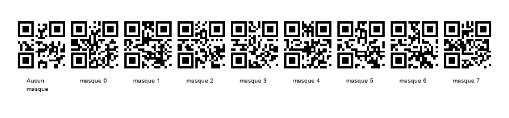
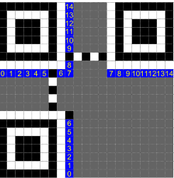
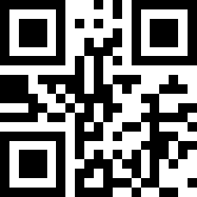

<!-- omit in toc -->
# Conception d'un QRCode version 1

---

title: Conception d'un QRCode modèle 1
author:

- François Soulié, ESIEE Paris
- Paul Tissedre, ESIEE Paris
  date: 12/28/2020

---

<!-- omit in toc -->
## Table des matières

- [Consigne](#consigne)
- [Coder les données](#coder-les-données)
  - [Message](#message)
  - [Niveau de correction](#niveau-de-correction)
  - [Taille du QRCode](#taille-du-qrcode)
  - [Indicateur de mode](#indicateur-de-mode)
  - [Indicateur du nombre de caractères](#indicateur-du-nombre-de-caractères)
  - [Codage du message](#codage-du-message)
  - [Division en mots de longueur 8 et ajout d'octets de remplissage](#division-en-mots-de-longueur-8-et-ajout-doctets-de-remplissage)
    - [Ajouts de bits de remplissage](#ajouts-de-bits-de-remplissage)
    - [Ajouts de bits de remplissages supplémentaires](#ajouts-de-bits-de-remplissages-supplémentaires)
    - [Ajouts de mots de remplissage](#ajouts-de-mots-de-remplissage)
- [Coder la correction d'erreur](#coder-la-correction-derreur)
  - [Polynome message](#polynome-message)
  - [Polynome générateur](#polynome-générateur)
  - [Détermination des mots de corrections](#détermination-des-mots-de-corrections)
- [Dessiner le QRCode](#dessiner-le-qrcode)
  - [Ajouts des motifs de localisation](#ajouts-des-motifs-de-localisation)
  - [Ajouts des séparateurs](#ajouts-des-séparateurs)
  - [Ajouts des motifs de synchronisation](#ajouts-des-motifs-de-synchronisation)
  - [Zones réservées et module noir](#zones-réservées-et-module-noir)
  - [Placement des données](#placement-des-données)
    - [Résultat](#résultat)
  - [Masques](#masques)
    - [Résultats pour chaque masque](#résultats-pour-chaque-masque)
    - [Calcul des points de pénalité](#calcul-des-points-de-pénalité)
    - [Ajout des infos de format et de version](#ajout-des-infos-de-format-et-de-version)
- [Conclusion](#conclusion)
  - [Étapes programmées](#étapes-programmées)

[Tutoriel suivi](https://www.thonky.com/qr-code-tutorial/)

# Consigne

(En groupe de 2, 3 ou 4) réaliser un QR code de 21 ou 25 modules, vous pouvez utiliser un programme existant en citant vos sources et en commentant le programme. Vous devez, en particulier, justifier votre choix de masque et expliquer le RS utilisé (fonctionnement et choix). La notation tiendra compte de la taille du groupe en lien avec ce qui aura été fait.

# Coder les données

## Message

`MATHSDISCRETES`

## Niveau de correction

On choisit le niveau de correction L pour notre QRCode, avec une capacité de correction associée de 7%.

## Taille du QRCode

Notre message a 14 caractères. Un QRCode de version 1 avec un niveau de correction L peut contenir 25 caractères donc on choisit cette version.

**SOURCE:** https://www.thonky.com/qr-code-tutorial/character-capacities

## Indicateur de mode

Notre message est alphanumérique, donc l'indicateur de mode est `0010`.

**SOURCE:** https://www.thonky.com/qr-code-tutorial/data-encoding#step-3-add-the-mode-indicator

## Indicateur du nombre de caractères

Notre message a 14 caractères : `1110` en binaire. On a choisit la version 1 pour notre QRCode ; cette version requiert un indicateur du nombre de caractères de longueur 9, donc on décale notre résultat précédent de 5 bits. On obtient `000001110`.

**SOURCE:** https://www.thonky.com/qr-code-tutorial/data-encoding#step-4-add-the-character-count-indicator

## Codage du message

Pour coder une chaîne de caractères en alphanumérique, on découpe cette dernière en groupes de 2 caractères auxquels on applique la formule: `code = 45*<valeur alpha de la lettre 1> + <valeur alpha de la lettre 2>`

```py
# Codage alpha-numérique
def alphanumeric_encode(msg):
    bytes = []
    divided = [msg[i:i+2] if i+2 <= len(msg) else msg[i:i+1]
               for i in range(0, len(msg), 2)]
    for pair in divided:
        if len(pair) >= 2:
            bits = bin((int(pair[0], 36)*45) + int(pair[1], 36))[2:]
        else:
            bits = bin((int(pair, 36)))[2:]
        while len(bits) < 11:
            bits = "0" + bits
        bytes.append(bits)
    return " ".join(bytes)
```

Ce programme affiche `1111101000 10100101010 10011111001 1101000110 1000110111 1010010011 1010010010`

On ajoute à cette suite nos indicateur de mode et du nombre de caractères : `0010` `000001110` `1111101000 10100101010 10011111001 1101000110 1000110111 1010010011 1010010010`

## Division en mots de longueur 8 et ajout d'octets de remplissage

Pour un QRCode de version 1 avec un niveau de correction L, on a besoin de 19 mots dans notre code final soit 152 bits. Or, notre mot a une longueur de 72.

**SOURCE:** https://www.thonky.com/qr-code-tutorial/error-correction-table

### Ajouts de bits de remplissage

On ajoute 4 0s à la fin de notre code : `0010` `000001110` `1111101000 10100101010 10011111001 1101000110 1000110111 1010010011 1010010010` `0000`

**SOURCE:** https://www.thonky.com/qr-code-tutorial/data-encoding#add-a-terminator-of-0s-if-necessary

### Ajouts de bits de remplissages supplémentaires

Pour avoir une taille multiple de 8, on ajoute des 0s supplémentaires à la fin de notre code.

### Ajouts de mots de remplissage

Tant que notre code n'a pas pour longueur 152 bits, on ajoute les mots suivants à la fin de ce dernier: `11101100 00010001`.

**SOURCE:** https://www.thonky.com/qr-code-tutorial/data-encoding#add-pad-bytes-if-the-string-is-still-too-short

```py
# Préparation du code
def prepare_code(msg, mode):
    alpha = alphanumeric_encode(msg)
    size_indicator = bin(len(msg))[2:]
    while len(size_indicator) < 9:
        size_indicator = "0" + size_indicator
    return "{} {} {}".format(mode, size_indicator, alpha)

# Remplissage du code
def fill_code(msg, mode, max):
    res = prepare_code(msg, mode)
    if len(code) < 152:
        res += " 0000"
    while len(code) % 8 != 0:
        res += "0"

    pad_length = (max-len(res))//8
    for i in range(pad_length):
        if i % 2 == 0:
            res += " 11101100"
        else:
            res += " 00010001"
    return res
```

Ce programme affiche: `0010` `000001110` `1111101000 10100101010 10011111001 1101000110 1000110111 1010010011 1001110110 00000000000 11101100 00010001 11101100 00010001 11101100 00010001 11101100`

# Coder la correction d'erreur

## Polynome message

Les mots de 8 bits de notre code converti en entiers correspondent aux coefficients de notre polynome message.

```py
# Détermination des coefficients
def msg_coeffs(msg, mode, max):
    filled_msg = fill_code(msg, mode, max).replace(" ", "")
    divided = [filled_msg[i:i+8] for i in range(0, len(filled_msg), 8)]
    coeffs = [str(int(word, 2)) for word in divided]

    return ",".join(coeffs)
```

Ce programme affiche `32,115,232,165,83,229,163,35,117,38,164,128,236,17,236,17,236,17,236`, qui sont les coefficients du polynome message.

Ensuite, pour afficher ce polynome avec ses coefficients, on a écrit le programme suivant

```py
# Détermination du polynome grâce aux coefficients
def coeffs_poly(coeffs):
    res = ""
    splitted = coeffs.split(",")
    for i, coeff in enumerate(splitted):
        res += "{}x^({})".format(coeff, len(splitted)-i-1)
        if i != len(splitted)-1:
            res += "+"
    return res
```

Qui nous retourne `P(x) = 32x^(18)+115x^(17)+232x^(16)+165x^(15)+83x^(14)+229x^(13)+163x^(12)+35x^(11)+117x^(10)+38x^(9)+164x^(8)+128x^(7)+236x^(6)+17x^(5)+236x^(4)+17x^(3)+236x^(2)+17x^(1)+236x^(0)`

## Polynome générateur

Pour un QRCode avec 7 mots de corrections, on a le polynome générateur `G(x)=α^(0)x^(7) + α^(87)x(6) + α^(229)x^(5) + α^(146)x^(4) + α^(149)x^3 + α^(238)x^(2) + α^(102)x + α^(21)`

**SOURCE:** https://www.thonky.com/qr-code-tutorial/generator-polynomial-tool

## Détermination des mots de corrections

Les mots de corrections sont les coefficients du reste de la division du polynome message par le polynome générateur.
Le reste de cette division est `211x^6 + 212x^5 + 181x^4 + 2x^3 + 31x^2 + 139x^1 + 106`
Les mots de corrections sont ainsi `211, 212, 181, 2, 31, 139, 106`

# Dessiner le QRCode

On a choisit un QRCode de version 1. La taille d'un QRCode a pour formule `S = (((<VERSION>-1)*4)+21)` donc le notre aura pour taille `21*21`.

## Ajouts des motifs de localisation

On ajoute en premier lieu les motifs de localisation à notre QRCode, dans les coins nord-ouest, nord-est et sud-ouest ; c'est-à-dire aux positions `(0,0), (14,0), (0,14)`

```py
def draw_pattern(qrcode, x, y):
    draw = ImageDraw.Draw(qrcode)
    draw.rectangle(
        [(x, y), (x+6, y+6)], outline="black", width=1)
    draw.rectangle(
        [(x, y), (x+6, y+6)], outline="black", width=1)
    draw.rectangle(
        [(x+2, y+2), (x+4, y+4)], outline="black", fill="black", width=1)
```


## Ajouts des séparateurs

On ajoute des séparateurs à notre QRCode, qui sont en fait des zones de taille 1 pixel dans lesquels nous ne reseignerons aucune donnée.



## Ajouts des motifs de synchronisation

```py
def draw_timing(qrcode):
    for i in range(7, 13):
        color = (0, 0, 0) if i % 2 == 0 else (255, 255, 255)
        qrcode.putpixel((i, 6), color)
        qrcode.putpixel((6, i), color)
```

On ajoute les motifs de synchronisation au QRCode, ce sont des lignes "pointillées" situées entre chaque motif de localisation.



## Zones réservées et module noir

On définit 3 zones réservées qui nous permettront par la suite de définir le format du QRCode pour qu'il soit lisible par des scanners. Aussi, on ajoute un pixel noir en haut à droit du motif de localisation sud-ouest.

```py
def draw_dark_module(qrcode):
    qrcode.putpixel((8, 4*1+9), (0, 0, 0))
```



## Placement des données

On place le code qu'on a déterminé précédemment sur notre QRCode, les 1 en noir et les 0 en blanc. Pour cela, on suit un chemin en "zigzag" de haut en bas et de droite à gauche du QRCode.
On part d'en bas à droite du QRCode, à la position `(20,20)` vers le haut jusqu'à ce qu'on atteigne une zone réservée ou la limite du QRCode, qui nous fait changer de sens et avancer de 2 colonnes vers la gauche. On part maintenant de la position `(18, 11)` vers le bas encore une fois jusqu'a atteindre une des limites du QRCode.

```py
def zigzag(col, start, end):
    res = []
    j = start
    k = 1
    if start > end:
        while j >= end:
            k = (k+1) % 2
            res.append((col-k, j))
            if k != 0:
                j -= 1
    else:
        while j <= end:
            k = (k+1) % 2
            res.append((col-k, j))
            if k != 0:
                j += 1
    return res

def draw_column(data, qrcode, col, start, end, mask):
    coords = zigzag(col, start, end)
    modules_coords = zigzag(20, 20, 14) + [(20, 13)]
    for i, p in enumerate(coords):
        value = apply_mask(int(data[i]), mask, p[1], p[0]) if (
            p[0], p[1]) not in modules_coords else int(data[i])
        color = (0, 0, 0) if value == 1 else (255, 255, 255)
        qrcode.putpixel(p, color)
    return i+1

def draw_data(msg, qrcode, mask):
    z = 0
    raw = coded_msg(msg, MODE, MAX, CORRECTION)
    coded = raw.replace(" ", "")
    z += draw_column(coded, qrcode, 20, 20, 9, mask)
    z += draw_column(coded[z:], qrcode, 18, 9, 20, mask)
    z += draw_column(coded[z:], qrcode, 16, 20, 9, mask)
    z += draw_column(coded[z:], qrcode, 14, 9, 20, mask)
    z += draw_column(coded[z:], qrcode, 12, 20, 7, mask)
    z += draw_column(coded[z:], qrcode, 12, 5, 0, mask)
    z += draw_column(coded[z:], qrcode, 10, 0, 5, mask)
    z += draw_column(coded[z:], qrcode, 10, 7, 20, mask)
    z += draw_column(coded[z:], qrcode, 8, 12, 9, mask)
    z += draw_column(coded[z:], qrcode, 5, 9, 12, mask)
    z += draw_column(coded[z:], qrcode, 3, 12, 9, mask)
    z += draw_column(coded[z:], qrcode, 1, 9, 12, mask)
```




### Résultat

Après avoir placé nos données, obtient le QRCode suivant.



On y est presque !

## Masques

Nous allons maintenant appliquer un masque à notre QRCode, afin de faciliter la lecture de ce dernier. Un masque est en fait une proposition que nous évaluons sur chaque pixel de notre QRCode et si ce dernier vérifie la proposition, alors on inverse sa valeur. Il existe 7 types de masque et donc 7 propositions.

```
def apply_mask(bit, mask, row, column):
    if mask == -1:
        return bit
    elif mask == 0:
        if (row+column) % 2 == 0:
            return 1 if bit == 0 else 0
    elif mask == 1:
        if (row) % 2 == 0:
            return 1 if bit == 0 else 0
    elif mask == 2:
        if (column) % 3 == 0:
            return 1 if bit == 0 else 0
    elif mask == 3:
        if (row + column) % 3 == 0:
            return 1 if bit == 0 else 0
    elif mask == 4:
        if (row // 2 + column // 3) % 2 == 0:
            return 1 if bit == 0 else 0
    elif mask == 5:
        if ((row * column) % 2) + ((row * column) % 3) == 0:
            return 1 if bit == 0 else 0
    elif mask == 6:
        if (((row * column) % 2) + ((row * column) % 3)) % 2 == 0:
            return 1 if bit == 0 else 0
    elif mask == 7:
        if (((row + column) % 2) + ((row * column) % 3)) % 2 == 0:
            return 1 if bit == 0 else 0
    return bit
```


### Résultats pour chaque masque



### Calcul des points de pénalité

Pour choisir le meilleur masque, on attribue des points de pénalité à chaque résultat selon 4 critères:

1. RunP: 3 points pour chaque lignes de taille 5 de la même couleur, 4 points pour chaque lignes de taille 6 de la même couleur, 5 points pour chaque lignes de taille 7 de la même couleur, 6 points pour chaque lignes de taille 8 de la même couleur, etc. (Ne peuvent pas être superposés)
2. BoxP: 3 points pour chaque carré de taille `2*2` de la même couleur. (Peuvent être superposés)
3. FindP: 40 points pour chaque suite ressemblant aux motifs de localisation.
4. BalP: 0 points si la proportion de points noirs est entre 45% et 55%, 10 points si elle est entre 40% et 60%, 20 points si elle est entre 25% et 65%, etc.

| Masque | RunP  | BoxP  | FindP | BalP  | Total |
| :----: | :---: | :---: | :---: | :---: | :---: |
|   0    |  169  |  99   |  800  |   0   | 1068  |
|   1    |  178  |  126  |  800  |   0   | 1104  |
|   2    |  182  |  126  | 1000  |   0   | 1308  |
|   3    |  184  |  132  |  800  |   0   | 1116  |
|   4    |  203  |  111  |  840  |   0   | 1154  |
|   5    |  197  |  159  |  920  |   0   | 1276  |
|   6    |  209  |  177  |  840  |   0   | 1226  |
|   7    |  188  |  108  |  800  |   0   | 1096  |

**SOURCE:** https://www.nayuki.io/page/creating-a-qr-code-step-by-step

On choisit le masque 0 car il a le moins de points de pénalité.

### Ajout des infos de format et de version

Les zones réservées précédemment sont maintenant utilisées pour renseigner sur le QRCode sa version et son masque afin de permettre aux scanners de le lire correctement.

```py
def draw_infos(qrcode, mask):
    if mask == -1:
        return
    info_strings = ["111011111000100", "111001011110011", "111110110101010", "111100010011101",
                    "110011000101111", "110001100011000", "110110001000001", "110100101110110"]
    bits = info_strings[mask]
    j = 0
    for i in range(8):
        if i == 6:
            continue
        color = (0, 0, 0) if int(bits[j]) == 1 else (255, 255, 255)
        qrcode.putpixel((i, 8), color)
        j += 1
    for i in range(8, -1, -1):
        if i == 6:
            continue
        color = (0, 0, 0) if int(bits[j]) == 1 else (255, 255, 255)
        qrcode.putpixel((8, i), color)
        j += 1
    j = 0
    for i in range(20, 13, -1):
        color = (0, 0, 0) if int(bits[j]) == 1 else (255, 255, 255)
        qrcode.putpixel((8, i), color)
        j += 1
    for i in range(13, 21):
        color = (0, 0, 0) if int(bits[j]) == 1 else (255, 255, 255)
        qrcode.putpixel((i, 8), color)
        j += 1
```



# Conclusion

Notre message `MATHSDISCRETES`, sous forme de QRCode est donc:



Avec le travail fourni, nous pensons avoir au moins 15/20. En effet, on y a investit beaucoup de temps (pratiquement 15 heures) en essayant de coder le maximum de parties de la création du QRCode ; cependant, nous n'avons pas programmé la création du polynôme générateur.
Néanmoins, la quasi-totalité des étapes de cette création à été programmée ce qui nous permettrais de générer des QRCodes de version 1 avec une capacité de correction de 7% pour n'importe quel message alphanumérique.
Grâce à cette approche un peu algorithmique, nous estimons ainsi avoir compris toutes les étapes de la conception d'un QRCode.

## Étapes programmées

| Codage alpha | Remplissage du code | Polynome message | Polynome générateur | Mots de correction | Localisation | Séparateurs | Synchronisation | Données | Infos de format et version | Applications des masques | Choix du masque |
| :----------: | :-----------------: | :--------------: | :-----------------: | :----------------: | :----------: | :---------: | :-------------: | :-----: | :------------------------: | :----------------------: | :-------------: |
|      ✓       |          ✓          |        ✓         |                     |                    |      ✓       |      ✓      |        ✓        |    ✓    |             ✓              |            ✓             |                 |
